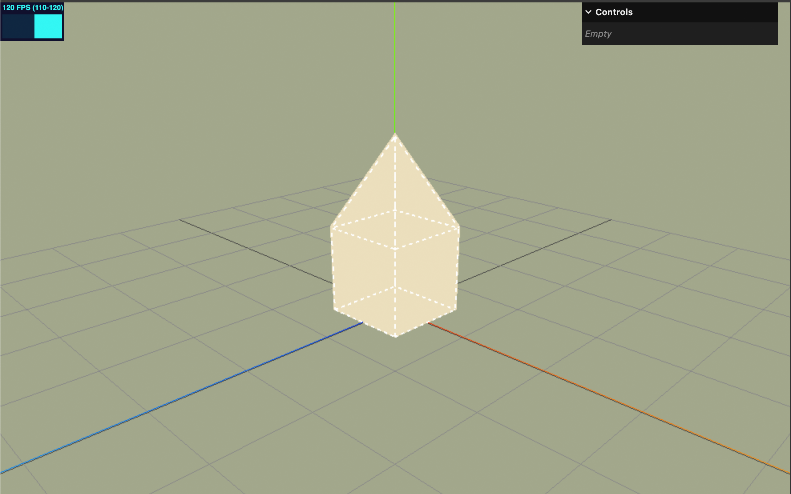

# three-object-controls

An opinionated way to transform Object3D objects in three.js.
Think of it as an alternative to TransformControls

Instead of having standard 3D-gizmo controls, this library provides a more intuitive way to transform objects in 3D space.



## Installation

```bash
TODO
```

## Usage

```typescript
import { ObjectControls } from "three-object-controls";

const objectControls = new ObjectControls(camera, renderer.domElement);

// TODO
```

## Demo

TODO
